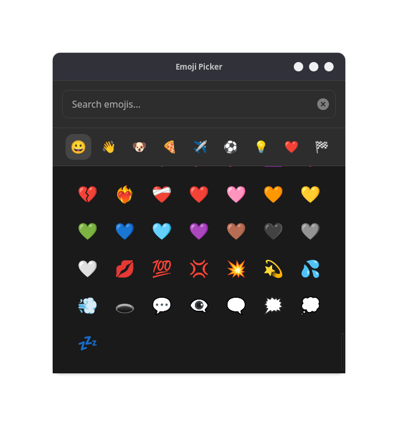
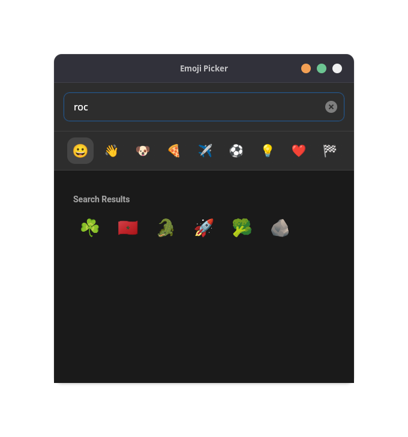

# emoji_picker

> [!WARNING]
> This project is still in development and is not ready for general use.

A simple emoji picker for desktop using dioxus

## To Do

- [x] Add support for searching emojis
- [x] Add better cross platform copy to clipboard support
- [ ] Add recent emojis section
- [ ] Add support for skin tone selection
- [ ] Add support for custom themes
- [ ] Make things more faster

## Preview




### Serving App

Run the following command in the root of project to start developing with the default platform:

```bash
dx serve
```

To run for a different platform, use the `--platform platform` flag. E.g.
```bash
dx serve --platform desktop
```
